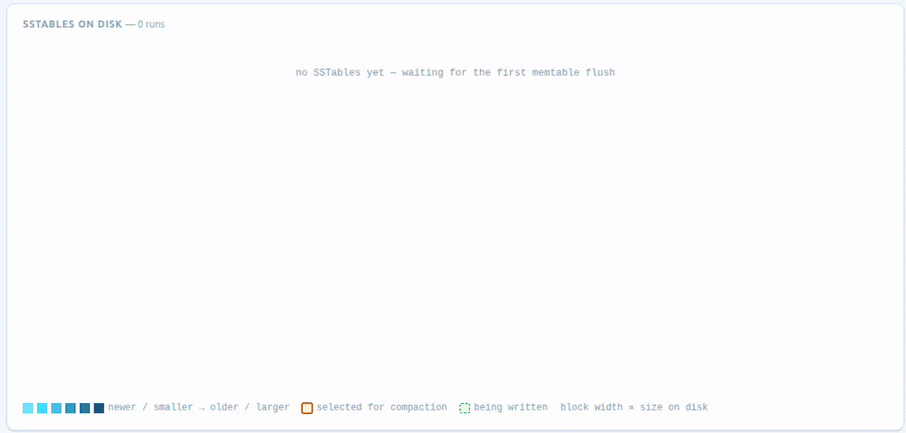

# ScyllaDB Compaction Strategy Simulator

An interactive, single-file simulator of the LSM write path — **write → commitlog → memtable →
flush → compaction** — built to make the tradeoffs between ScyllaDB's compaction strategies
visible instead of abstract.

Pick a strategy and a workload and watch SSTables accumulate, get bucketed into tiers / levels /
runs / time windows, and get merged away — while space, write and read amplification are measured
live from the simulated data rather than asserted.

**Disclaimer:** An independent, educational simulator — not an official ScyllaDB product and not
100% behaviorally accurate to real ScyllaDB internals. Not affiliated with or endorsed by
ScyllaDB, Inc.



## Strategies

| Class | What the simulator models |
|---|---|
| **STCS** — Size-Tiered | `bucket_low`/`bucket_high` bucketing around each tier's running average; a tier of `min_threshold` files merges into one big file, holding inputs *and* output on disk at once |
| **LCS** — Leveled | fixed-size SSTables, fan-out of 10, non-overlapping key ranges from L1 down, L0 flushed wholesale into L1, per-level score picking the next job |
| **ICS** — Incremental | the same size-tiered bucketing, but over SSTable **runs** of key-disjoint fragments; output fragments are sealed one at a time and consumed inputs are deleted mid-compaction, plus the `space_amplification_goal` cross-tier job |
| **TWCS** — Time-Window | bucketing by the window of an SSTable's newest write, size-tiered inside the current window, older windows sealed to one file, fully-expired SSTables dropped without a rewrite |

The selection rules are ports of `scylladb/compaction/*.cc` — `size_tiered_compaction_strategy::get_buckets`
and `most_interesting_bucket`, `incremental_compaction_strategy` (including the SAG job),
`leveled_manifest`'s L0 threshold and level scores, and `time_window_compaction_strategy`'s
bucketing. Sub-property names and semantics match
[the CQL compaction docs](https://docs.scylladb.com/manual/stable/cql/compaction.html).

## What the numbers mean

One row of simulated data is one "MB", so every size on screen shares a unit with the CQL
sub-properties it mirrors.

- **Space amplification** — bytes on disk ÷ bytes of live, unexpired data. Counts the partially
  written output of an in-flight compaction, which is exactly where STCS spikes and ICS doesn't.
- **Write amplification** — total bytes ever written to disk ÷ bytes flushed from the memtable.
- **Read amplification** — files a single-key lookup may have to touch: SSTables for STCS/TWCS,
  runs for ICS, L0 files plus one per level for LCS. Bloom filters are not modelled, so this is
  an upper bound.

## Things worth trying

- **STCS vs ICS, overwrite-heavy.** Identical write amplification and identical tiering — but watch
  *peak* space amplification — ICS frees input fragments mid-compaction, so its output block never
  sits alongside a full second copy of the tier.
- **Time-series workload + TWCS.** Whole SSTables expire together and are dropped with no merge at
  all; write amplification stays near the floor.
- **Time-series workload + TWCS, then switch to overwrite-heavy.** Windows never stop opening and
  space amplification runs away — the reason TWCS is only for append-only data.
- **LCS on any workload.** Space amplification pinned near 1.0×, read amplification of a few files,
  paid for with the highest write amplification of the four.
- **ICS with `space_amplification_goal` = 1.25.** An extra cross-tier compaction of the two largest
  tiers kicks in whenever (S0+S1)/S0 drifts above the goal, holding the space-amp line down.

## Running it

Static, dependency-free, no build step:

```bash
git clone https://github.com/tzach/compaction-viz.git
cd compaction-viz
open index.html   # or double-click it / drag it into a browser
```

Styled with the ScyllaDB design system (`scylladb-ds.css`), same as
[scylladb-ha-demo](https://github.com/tzach/scylladb-ha-demo).
