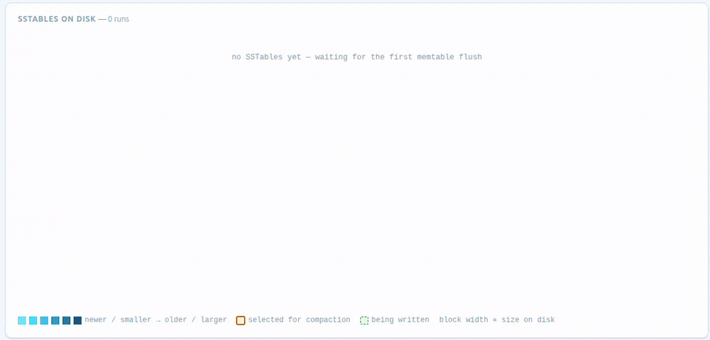

# ScyllaDB Compaction Strategy Simulator

An interactive, single-file simulator of the LSM write path — **write → commitlog → memtable →
flush → compaction** — built to make the tradeoffs between ScyllaDB's compaction strategies
visible instead of abstract.

Pick a strategy and a workload and watch SSTables accumulate, get bucketed into tiers / levels /
runs / time windows, and get merged away — while space, write and read amplification are measured
live from the simulated data rather than asserted.

**Disclaimer:** An independent, educational simulator — not an official ScyllaDB product and not
100% behaviorally accurate to real ScyllaDB internals. Not affiliated with or endorsed by
ScyllaDB, Inc.



## Strategies

| Class | What the simulator models |
|---|---|
| **LCS** — Leveled | fixed-size SSTables, fan-out of 10, non-overlapping key ranges from L1 down, L0 flushed wholesale into L1, per-level score picking the next job |
| **ICS** — Incremental | the same size-tiered bucketing, but over SSTable **runs** of key-disjoint fragments; output fragments are sealed one at a time and consumed inputs are deleted mid-compaction, plus the `space_amplification_goal` cross-tier job |
| **TWCS** — Time-Window | bucketing by the window of an SSTable's newest write, size-tiered inside the current window, older windows sealed to one file, fully-expired SSTables dropped without a rewrite |

Size-tiered compaction itself isn't offered as a standalone choice — it survives inside ICS (which
tiers *runs* rather than files), inside LCS's L0, and inside TWCS's current window, which is where
you can watch it.

The selection rules are ports of `scylladb/compaction/*.cc` — `size_tiered_compaction_strategy::get_buckets`
and `most_interesting_bucket`, `incremental_compaction_strategy` (including the SAG job),
`leveled_manifest`'s L0 threshold and level scores, and `time_window_compaction_strategy`'s
bucketing. Sub-property names and semantics match
[the CQL compaction docs](https://docs.scylladb.com/manual/stable/cql/compaction.html).

## What the numbers mean

One row of simulated data is one "MB", so every size on screen shares a unit with the CQL
sub-properties it mirrors.

- **Space amplification** — bytes on disk ÷ bytes of live, unexpired data. Counts the partially
  written output of an in-flight compaction, which is exactly where a single-file merge spikes and
  ICS doesn't.
- **Write amplification** — total bytes ever written to disk ÷ bytes flushed from the memtable.
- **Read amplification** — files a single-key lookup may have to touch: runs for ICS, L0 files plus
  one per level for LCS, SSTables for TWCS. Bloom filters are not modelled, so this is an upper bound.

## Things worth trying

- **ICS, overwrite-heavy.** Watch *peak* space amplification: ICS frees input fragments
  mid-compaction, so its output never sits alongside a full second copy of the tier.
- **Time-series workload + TWCS.** Whole SSTables expire together and are dropped with no merge at
  all; write amplification stays near the floor.
- **TWCS, then switch to overwrite-heavy.** Selecting TWCS moves the workload to time series for you;
  switch it back to overwrite-heavy and windows never stop opening, so space amplification runs away.
  That's the reason TWCS is only for append-only data.
- **LCS on any workload.** Space amplification pinned near 1.0×, read amplification of a few files,
  paid for with the highest write amplification of the four.
- **ICS with `space_amplification_goal` = 1.25.** An extra cross-tier compaction of the two largest
  tiers kicks in whenever (S0+S1)/S0 drifts above the goal, holding the space-amp line down.

## Sharing a run

**Share** copies a link to the state on screen, and opens the simulator paused at that state. The
model is deterministic — one fixed PRNG seed — so the link only carries the settings and the tick
count, and the run replays from tick 0 with those settings.

| Parameter | Values |
|---|---|
| `strategy` | `lcs`, `ics`, `twcs` |
| `workload` | `hot`, `uniform`, `ts` |
| `tick` | how many ticks to replay, 0&ndash;4000 |
| `min_threshold` | 2&ndash;8 (ICS, TWCS) |
| `sstable_size` | 200&ndash;2000 for ICS, 32&ndash;320 for LCS |
| `sag` | `0`, `1.25`, `1.5`, `2` (ICS) |
| `window_size` | 1&ndash;12 (TWCS) |
| `window_unit` | `MINUTES`, `HOURS`, `DAYS` (TWCS) |
| `ttl` | rows expire after this many ticks |
| `speed` | `0.25`, `0.5`, `1`, `2`, `3`, `4`, `5`, `6`, `7`, `8` |

Example — LCS on uniform keys, 160 MB SSTables, 200 ticks in:
`?strategy=lcs&workload=uniform&sstable_size=160&tick=200`

Out-of-range or unknown values fall back to the default, and a link cannot reach a combination the
controls refuse (TWCS always gets the time-series workload). TWCS links now use
`window_size`/`window_unit`; older `window` links are still accepted when that duration can be
represented exactly by the current controls. A link taken after you move a slider mid-run shows the
run that setting would have produced from the start.

## Running it

**[Open the live simulator →](https://tzach.github.io/compaction-viz/)**

Or run it locally — static, dependency-free, no build step:

```bash
git clone https://github.com/tzach/compaction-viz.git
cd compaction-viz
open index.html   # or double-click it / drag it into a browser
```

Styled with the ScyllaDB design system (`scylladb-ds.css`), same as
[scylladb-ha-demo](https://github.com/tzach/scylladb-ha-demo).
